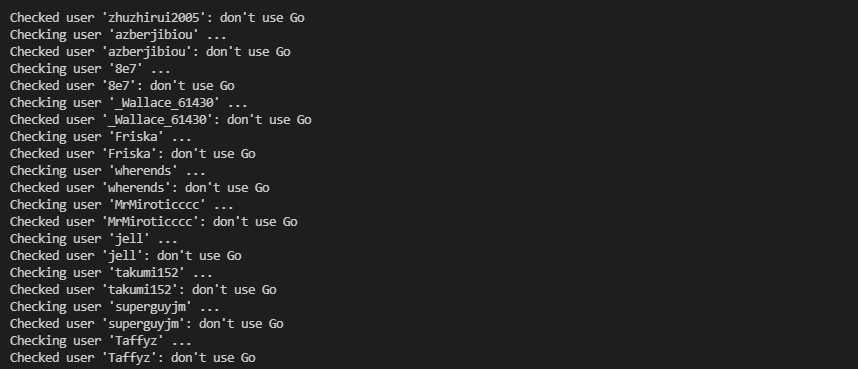
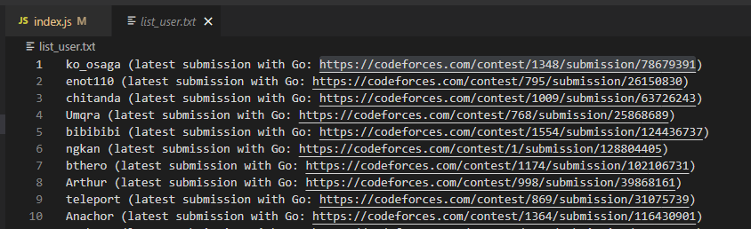

## Background
When I practice in codeforces, I want to find an user who uses some specific language(e.g. Now I want to find a guy use Golang).
Why? I want to see what they do and maybe I'll learn something. As you can see, the most popular language use in codeforces is C++, but when you want to find another language that isn't polular, it's seem quite hard. So I decided to write a small script to help us to do that :D.

This small script will help you find some users who use a specific language

## Screen shot
This is screenshot when search for language: "Go"<br>
<br><br>
## Usage
Just clone the code then run
```js
npm install
node index.js
```
The result will be saved at './list_user.txt'

## How it works?
Firstly, the script will get list of users in each page from 1 -> 60 (can config by yourself).
For each user, the script will call codeforces's API to get 500 submissons (can config) and check if exists at least 3 (can config) ACCEPTED submission with 'Go' (can config).
If it has, the script will consider the user use 'Go' and append the result to './list_user.txt'.

## Arguments
- <b>LANGUAGE</b>: The language you need to find.
- <b>NUMBER_OF_PAGE</b> : the number of page that we search on, each page(e.g. https://codeforces.com/ratings/page/1) will contain 200 users sorted by rating decrease. E.g. page 1 contain LGM and IGM, if we need find from tourist to someone that have rating ~1k6 we need page about 60.
- <b>NUMBER_OF_SUBMISSION</b>: The submissions to check of an user to determine whether he ussually use the language you want to find. Default is 500.
- <b>NUMBER_TO_CONSIDER_USED</b>: The number of accepted submission that we consider user is use that language.

## Note
This script work quite slow, each user will need about 2-3s to check.
You can speed it up by limit the list it find(E.g. Search in specific counntry...)